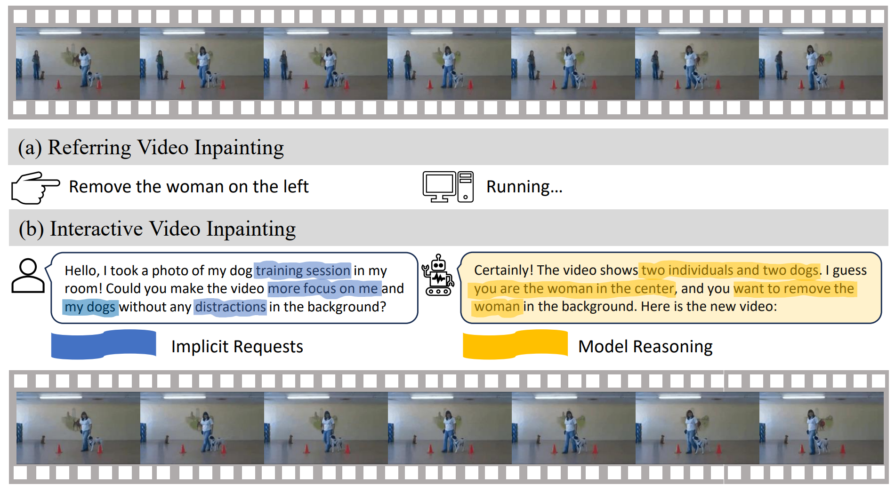

<br />
<p align="center">
  <h1 align="center">Towards Language-Driven Video Inpainting via Multimodal Large Language Models</h1>
  <p align="center">
    <br />
    <a href="https://jianzongwu.github.io/"><strong>Jianzong Wu</strong></a>
    ·
    <a href="https://lxtgh.github.io/"><strong>Xiangtai Li</strong></a>
    ·
    <a href="https://chenyangsi.github.io/"><strong>Chenyang Si</strong></a>
    ·
    <a href="https://shangchenzhou.com/"><strong>Shangchen Zhou</strong></a>
    ·
    <a href="https://jingkang50.github.io/"><strong>Jingkang Yang</strong></a>
    ·
    <a href="https://zhangzjn.github.io/"><strong>Jiangning Zhang</strong></a>
    <br />
    <a href="https://github.com/ly015"><strong>Yining Li</strong></a>
    ·
    <a href="https://chenkai.site/"><strong>Kai Chen</strong></a>
    ·
    <a href="https://scholar.google.com/citations?user=T4gqdPkAAAAJ"><strong>Yunhai Tong</strong></a>
    ·
    <a href="https://liuziwei7.github.io/"><strong>Ziwei Liu</strong></a>
    ·
    <a href="https://www.mmlab-ntu.com/person/ccloy/"><strong>Chen Change Loy</strong></a>
  </p>

  <p align="center">
    <a href='https://arxiv.org/abs/2401.10226'>
      
    </a>
    <a href='https://github.com/jianzongwu/Language-Driven-Video-Inpainting'>
      
    </a>
    <a href='https://jianzongwu.github.io/projects/rovi'>
      
    </a>
  </p>
<br />

<div  align="center">    
 
</div>

**Our work is the first to explore language-driven video inpainting. We define the new tasks, provide a new benchmark, and baseline models.**

# ⭐ Abstract

We introduce a new task -- language-driven video inpainting, which uses natural language instructions to guide the inpainting process. This approach overcomes the limitations of traditional video inpainting methods that depend on manually labeled binary masks, a process often tedious and labor-intensive. We present the Remove Objects from Videos by Instructions (ROVI) dataset, containing 5,650 videos and 9,091 inpainting results, to support training and evaluation for this task. We also propose a novel diffusion-based language-driven video inpainting framework, the first end-to-end baseline for this task, integrating Multimodal Large Language Models to understand and execute complex language-based inpainting requests effectively. Our comprehensive results showcase the dataset's versatility and the model's effectiveness in various language-instructed inpainting scenarios. We will make datasets, code, and models publicly available.

# 📢 Updates

- [2024.3.7] Datasets, model, code, and demo are released!
- [2024.2.26] Our paper is accepted by CVPR 2024!
- [2024.1.18] Our paper is posted on [arXiv](https://arxiv.org/abs/2401.10226)!

# 🏆 Contributions

- **Language-Driven Video Inpainting Task.** We introduce a novel language-driven video inpainting task, significantly reducing reliance on human-labeled masks in video inpainting applications. This approach encompasses two distinct sub-tasks: referring video inpainting and interactive video inpainting. 

- **The ROVI Dataset.** We propose a dataset to facilitate training and evaluation for the proposed tasks. This dataset is the first of its kind, containing triplets of original videos, removal expressions, and inpainted videos, offering a unique resource for research in this domain.

- **Diffusion-based baseline Models.** We present a diffusion-based architecture, LGVI, as a baseline model for the proposed task. We show how one could leverage MLLMs to improve language guidance for interactive video inpainting. To our knowledge, it is the first model to perform end-to-end language-driven video inpainting.

# Data access

Our ROVI dataset can be downloaded form [huggingface](https://huggingface.co/datasets/jianzongwu/rovi). This dataset is built upon YouTube-VOS and A2D-Sentences. We have annonated them with inpainting results and organized them into one union format. We hope this data can help the research on multimodal perception and editing.

To prevent data contamination and reduce evaluation time. We only provide part of the testing data in `test.json`.

# Model access

Please download our pre-trained LGVI and LGVI-I checkpoints from huggingface.

Please note that we found common measures like PSNR, SSIM, and VFID might not truly show how good the inpainting results are. A not adequately trained model tends not to alter videos significantly. However, such a trivial output potentially skews certain metrics toward higher values. As we train the model for a longer time, we see better inpainting performance, even though the scores go down. In this repository, we share the checkpoints with longer training schedule and better visual results.

|Model|Link|
|-|-|
|LGVI|[huggingface model](https://huggingface.co/jianzongwu/lgvi)|
|LGVI-I|[huggingface model](https://huggingface.co/jianzongwu/lgvi-i)|

To use lgvi-i, please also download the [llava-v1.5-7b checkpoint](https://huggingface.co/liuhaotian/llava-v1.5-7b) and [vit-large-patch14-336](https://huggingface.co/openai/clip-vit-large-patch14-336) checkpoint.

Please organize all the checkpoints them as follows:

```
checkpoints
    |- lgvi
    |- lgvi-i
    |- clip-vit-large-patch14-336
    |- llava-v1.5-7b
```

# Environment preparation

We highly recommend using Conda to manage the environment.

## 1. Create a new environment.

We use python version 3.9. Other version may conflict with xformers.

``` bash
conda create -n rovi python=3.9
conda activate rovi
```

## 2. Install Pytorch

In this repo, we use pytorch version 2.0.1. Other versions may conflict with xformers
``` bash
conda install pytorch==2.0.1 torchvision==0.15.2 torchaudio==2.0.2 pytorch-cuda=11.8 -c pytorch -c nvidia
```

## 3. Install other dependencies

``` bash
pip install -r requirements.txt
conda install xformers -c xformers
cd rovi/llm
pip install -e .
pip install flash-attn --no-build-isolation
```

# Inference

## Inferece LGVI for referring expressions

``` bash
python -m inference_referring \
  --video_path videos/two-birds \
  --ckpt_path checkpoints/lgvi \
  --expr "remove the bird on left" \
```

## Inferece LGVI-I for interactive expressions

``` bash
python -m inference_interactive \
  --video_path videos/city-bird \
  --ckpt_path checkpoints/lgvi-i \
  --request "I have this incredible shot of a pelican gliding in the sky, but there's another bird also captured in the frame. Can you help me make the picture solely about the pelican?" \
```

# Citation

```
@article{wu2024lgvi,
  title={Towards language-driven video inpainting via multimodal large language models},
  author={Wu, Jianzong and Li, Xiangtai and Si, Chenyang and Zhou, Shangchen and Yang, Jingkang and Zhang, Jiangning and Li, Yining and Chen, Kai and Tong, Yunhai and Liu, Ziwei and others},
  journal={arXiv preprint arXiv:2401.10226},
  year={2024}
}
```